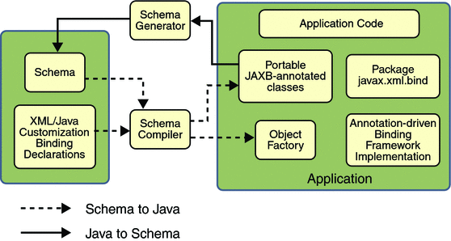
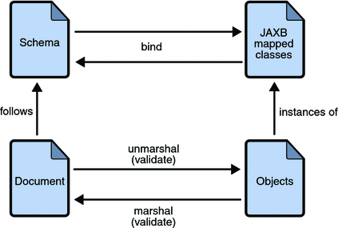

# jaxb-demo
This is a demo for Java Architecture for XML Binding (JAXB).

## What's [JAXB](https://javaee.github.io/jaxb-v2/)

```markdown
The Java™ Architecture for XML Binding (JAXB) provides an API and tools that automate the mapping between XML documents and Java objects.

The JAXB framework enables developers to perform the following operations:
1. Unmarshal XML content into a Java representation
2. Access and update the Java representation
3. Marshal the Java representation of the XML content into XML content

JAXB gives Java developers an efficient and standard way of mapping between XML and Java code. Java developers using JAXB are more productive because they can write less code themselves and do not have to be experts in XML. JAXB makes it easier for developers to extend their applications with XML and Web Services technologies.
```

**[jaxb-ri download](https://repo1.maven.org/maven2/com/sun/xml/bind/jaxb-ri/2.3.1/jaxb-ri-2.3.1.zip)**

**Requirement**
```markdown
Java™ 2 Platform, Standard Edition (J2SE™) Requirements
This release of the JAXB Reference Implementation requires Java SE 7 or higher.
```
| Use      | Description                                                     | Jars                                                     |
|----------|-----------------------------------------------------------------|----------------------------------------------------------|
| Runtime  | Jars required to deploy a JAXB 2.x client                       | jaxb-api.jar, jaxb-core.jar, jaxb-impl.jar               |
| Compiler | Jars required at your development environment (but not runtime) | jaxb-api.jar, jaxb-core.jar, jaxb-impl.jar, jaxb-xjc.jar |

```xml
<dependencies>
    <dependency>
        <groupId>com.sun.xml.bind</groupId>
        <artifactId>jaxb-core</artifactId>
        <version>${jaxb-core.version}</version>
    </dependency>
    <dependency>
        <groupId>javax.xml.bind</groupId>
        <artifactId>jaxb-api</artifactId>
        <version>${jaxb-api.version}</version>
    </dependency>
    <dependency>
        <groupId>com.sun.xml.bind</groupId>
        <artifactId>jaxb-impl</artifactId>
        <version>${javax-jaxb.version}</version>
    </dependency>
</dependencies>
```

## Why [JAXB](https://www.oracle.com/technical-resources/articles/javase/jaxb.html)

**与它类似的产品还有the Simple API for XML ([SAX](http://www.saxproject.org/)) 和 the Document Object Model([DOM](https://dom.spec.whatwg.org/))**
```markdown
Java developers can invoke a SAX or DOM parser in an application through the JAXP API to parse an XML document -- that is, scan the document and logically break it up into discrete pieces. The parsed content is then made available to the application.
In the SAX approach, the parser starts at the beginning of the document and passes each piece of the document to the application in the sequence it finds it. Nothing is saved in memory. The application can take action on the data as it gets it from the parser, but it can't do any in-memory manipulation of the data. For example, it can't update the data in memory and return the updated data to the XML file.
In the DOM approach, the parser creates a tree of objects that represents the content and organization of data in the document. In this case, the tree exists in memory. The application can then navigate through the tree to access the data it needs, and if appropriate, manipulate it.
```

## Basic concept

* **Schema**
```markdown
A schema is an XML specification that governs the allowable components of an XML document and the relationships between the components. For example, a schema identifies the elements that can appear in an XML document, in what order they must appear, what attributes they can have, and which elements are subordinate (that is, are child elements) to other elements. An XML document does not have to have a schema, but if it does, it must conform to that schema to be a valid XML document. JAXB requires that the XML document you want to access has a schema, and that schema is written in [the W3C XML Schema Language](http://www.w3.org/TR/xmlschema-0).
对xml格式的规范，在项目应用中有可能是一个sxd文件
```
* **Binding**
```markdown
Binding a schema means generating a set of Java classes that represents the schema. All JAXB implementations provide a tool called a binding compiler to bind a schema (the way the binding compiler is invoked can be implementation-specific). For example, the JAXB Reference Implementation provides a binding compiler that you can invoke through scripts. Suppose, for example, you want to bind the books.xsd schema using the binding compiler provided by the JAXB Reference Implementation.
生成一组表示schema的java类
```

## XSD
```markdown
Xml Schemas Definition
```
* **targetNamespace**
````markdown
java文件的package
例如： 
targetNamespace="http:www.alan.com/schemas"
=>
com.alan.schemas
````
* **xmlns**
```markdown
xml namespace 引入命名空间
例如：
xmlns:xs="http://www.w3.org/2001/XMLSchema"
冒号后定义该namespace简写，下文用简写来使用,如果不写则表示默认namespace
<xs:element name=""></xs:element>
```
* **schemaLocation**
```markdown
指定schema位置, 必须key value成对数据， 前面是namespace， 后面是location
例如
xs:schemaLocation:"http://www.w3.org/2001/XMLSchema http://www.w3.org/2001/XMLSchema.xsd"
```

* **elementFormDefault**
```markdown
所有全局子元素将会默认放到目标命名空间
```

## Architectural Overview


A JAXB implementation consists of the following architectural components:
* **Schema compiler**:
```markdown
Binds a source schema to a set of schema-derived program elements. The binding is described by an XML-based binding language.
```

* **Schema generator**: 
```markdown
Maps a set of existing program elements to a derived schema. The mapping is described by program annotations.
```

* **Binding runtime framework**: 
```markdown
Provides unmarshalling (reading) and marshalling (writing) operations for accessing, manipulating, and validating XML content using either schema-derived or existing program elements.
```

## The JAXB Binding Process


The general steps in the JAXB data binding process are:

* **Generate classes**: 
```markdown
An XML schema is used as input to the JAXB binding compiler to generate JAXB classes based on that schema.
```
* **Compile classes**:
```markdown
All of the generated classes, source files, and application code must be compiled.
```

* **Unmarshal**: 
```markdown
XML documents written according to the constraints in the source schema are unmarshalled by the JAXB binding framework. Note that JAXB also supports unmarshalling XML data from sources other than files and documents, such as DOM nodes, string buffers, SAX sources, and so forth.
```

* **Generate content tree**:
```markdown
The unmarshalling process generates a content tree of data objects instantiated from the generated JAXB classes; this content tree represents the structure and content of the source XML documents.
```

* **Validate (optional)**:

```markdown
The unmarshalling process involves validation of the source XML documents before generating the content tree. Note that if you modify the content tree in Step 6, you can also use the JAXB Validate operation to validate the changes before marshalling the content back to an XML document.
```

* **Process content**:
```markdown
The client application can modify the XML data represented by the Java content tree by using interfaces generated by the binding compiler.
```

* **Marshal**:
```markdown
The processed content tree is marshalled out to one or more XML output documents. The content may be validated before marshalling.
```

## Binding compile And Schema generate

### XJC or SchemaGen

```markdown
The XJC can process schemas to JAVA files.
The SchemaGen can process either Java source files or class files to schemas.
```

* **Solaris/Linux**
```shell
% /path/to/jaxb/bin/xjc.sh -help
% path/to/jaxb/bin/schemagen.sh Foo.java Bar.java ...
```

* **Windows**
```shell
> c:\path\to\jaxb\bin\xjc.bat -help
> path\to\jaxb\bin\schemagen.bat Foo.java Bar.java ...
```

### Maven plugin

```xml
<plugin>
        <groupId>org.codehaus.mojo</groupId>
        <artifactId>jaxb2-maven-plugin</artifactId>
        <version>${jaxb-plugin.version}</version>
        <executions>
            <execution>
                <goals>
                    <goal>xjc</goal>
                </goals>
            </execution>
        </executions>
        <configuration>
            <sources>
                <source>src/main/resources/schemas/xsd</source>
                <!--<source>src/main/java/com/alan/entity/schemas</source>-->
            </sources>
            <noGeneratedHeaderComments>true</noGeneratedHeaderComments>
            <noPackageLevelAnnotations>true</noPackageLevelAnnotations>
        </configuration>
    </plugin>
```
```shell
mvn jaxb2:xjc
mvn jaxb2:schemagen
```

### Example
* XJC
```xml
<?xml version="1.0" encoding="UTF-8" ?>
<xs:schema xmlns="http:www.alan.com/schemas"
        xmlns:xs="http://www.w3.org/2001/XMLSchema"
           targetNamespace="http:www.alan.com/schemas"
           elementFormDefault="qualified"
>
    <xs:element name="Book">
        <xs:complexType>
            <xs:sequence>
                <xs:element name="Name">
                    <xs:simpleType>
                        <xs:restriction base="xs:string">
                            <xs:maxLength value="5"/>
                        </xs:restriction>
                    </xs:simpleType>
                </xs:element>
                <xs:element name="Auth" type="xs:string" minOccurs="0"/>
            </xs:sequence>
        </xs:complexType>
    </xs:element>
</xs:schema>
```
```java
package com.alan.schemas;

import javax.xml.bind.annotation.XmlAccessType;
import javax.xml.bind.annotation.XmlAccessorType;
import javax.xml.bind.annotation.XmlElement;
import javax.xml.bind.annotation.XmlRootElement;
import javax.xml.bind.annotation.XmlType;


/**
 * <p>Java class for anonymous complex type.
 * 
 * <p>The following schema fragment specifies the expected content contained within this class.
 * 
 * <pre>
 * &lt;complexType&gt;
 *   &lt;complexContent&gt;
 *     &lt;restriction base="{http://www.w3.org/2001/XMLSchema}anyType"&gt;
 *       &lt;sequence&gt;
 *         &lt;element name="Name"&gt;
 *           &lt;simpleType&gt;
 *             &lt;restriction base="{http://www.w3.org/2001/XMLSchema}string"&gt;
 *               &lt;maxLength value="5"/&gt;
 *             &lt;/restriction&gt;
 *           &lt;/simpleType&gt;
 *         &lt;/element&gt;
 *         &lt;element name="Auth" type="{http://www.w3.org/2001/XMLSchema}string" minOccurs="0"/&gt;
 *       &lt;/sequence&gt;
 *     &lt;/restriction&gt;
 *   &lt;/complexContent&gt;
 * &lt;/complexType&gt;
 * </pre>
 * 
 * 
 */
@XmlAccessorType(XmlAccessType.FIELD)
@XmlType(name = "", propOrder = {
    "name",
    "auth"
})
@XmlRootElement(name = "Book", namespace = "http:www.alan.com/schemas")
public class Book {

    @XmlElement(name = "Name", namespace = "http:www.alan.com/schemas", required = true)
    protected String name;
    @XmlElement(name = "Auth", namespace = "http:www.alan.com/schemas")
    protected String auth;

    /**
     * Gets the value of the name property.
     * 
     * @return
     *     possible object is
     *     {@link String }
     *     
     */
    public String getName() {
        return name;
    }

    /**
     * Sets the value of the name property.
     * 
     * @param value
     *     allowed object is
     *     {@link String }
     *     
     */
    public void setName(String value) {
        this.name = value;
    }

    /**
     * Gets the value of the auth property.
     * 
     * @return
     *     possible object is
     *     {@link String }
     *     
     */
    public String getAuth() {
        return auth;
    }

    /**
     * Sets the value of the auth property.
     * 
     * @param value
     *     allowed object is
     *     {@link String }
     *     
     */
    public void setAuth(String value) {
        this.auth = value;
    }

}
```

* Schemagen
```java
package com.alan.entity.schemas;

import javax.xml.bind.annotation.*;

@XmlAccessorType(XmlAccessType.FIELD)
@XmlType(name = "", propOrder = {
        "name",
        "age"
})
@XmlRootElement(name = "Person", namespace = "http:www.alan.com/schemas")
public class Person {

    @XmlElement(name = "Name", namespace = "http:www.alan.com/schemas", required = true)
    protected String name;
    @XmlElement(name = "Age", namespace = "http:www.alan.com/schemas")
    protected Integer age;

    public String getName() {
        return name;
    }

    public void setName(String name) {
        this.name = name;
    }

    public Integer getAge() {
        return age;
    }

    public void setAge(Integer age) {
        this.age = age;
    }
}
```
```xml
<?xml version="1.0" encoding="UTF-8" standalone="yes"?>
<xs:schema xmlns:xs="http://www.w3.org/2001/XMLSchema" targetNamespace="http:www.alan.com/schemas" version="1.0">
    
  <xs:element name="Person">
        
    <xs:complexType>
            
      <xs:sequence>
                
        <xs:element form="qualified" name="Name" type="xs:string"/>
                
        <xs:element form="qualified" minOccurs="0" name="Age" type="xs:int"/>
              
      </xs:sequence>
          
    </xs:complexType>
      
  </xs:element>
  
</xs:schema>
```

## Unmarshal the Document
```xml
<?xml version="1.0" encoding="UTF-8" ?>
<Book xmlns="http:www.alan.com/schemas">
    <Name>123456</Name>
    <Auth>aaa</Auth>
</Book>
```

```java
public class UnitTest {
    @Test
    void unmarshalDocument() throws JAXBException, JsonProcessingException {
        //JAXBContext jaxbContext = JAXBContext.newInstance("com.alan.schemas");
        //JAXBContext jaxbContext = JAXBContext.newInstance(ObjectFactory.class);
        JAXBContext jaxbContext = JAXBContext.newInstance(Book.class);
        Unmarshaller unmarshaller = jaxbContext.createUnmarshaller();
        Book book = (Book) unmarshaller.unmarshal(new File("book.xml"));
        System.out.println(new ObjectMapper().writeValueAsString(book));
    }
}
```

## Marshal Object
```java
public class UnitTest {
    @Test
    void marshalObject() throws JAXBException {
        JAXBContext jaxbContext = JAXBContext.newInstance(ObjectFactory.class);
        Marshaller marshaller = jaxbContext.createMarshaller();
        Book book = new Book();
        book.setName("123456");
        book.setAuth("aaaaaaa");
        StringWriter stringWriter = new StringWriter();
        marshaller.marshal(book, stringWriter);
        // <?xml version="1.0" encoding="UTF-8" standalone="yes"?><Book xmlns="http:www.alan.com/schemas"><Name>123456</Name><Auth>aaaaaaa</Auth></Book>
        System.out.println(stringWriter);
    }
}
```

## Generate Schema
```java
public class UnitTest {
    @Test
    void generateSchema() throws JAXBException, IOException {
        JAXBContext jaxbContext = JAXBContext.newInstance(Person.class);
        jaxbContext.generateSchema(new SchemaOutputResolver() {
            @Override
            public Result createOutput(String namespaceUri, String suggestedFileName) {
                return new StreamResult(new File(suggestedFileName));
            }
        });
    }
}
```

## Data validate
```java
package com.alan;

import com.alan.entity.schemas.Person;
import com.alan.schemas.Book;
import com.alan.schemas.ObjectFactory;
import com.fasterxml.jackson.core.JsonProcessingException;
import com.fasterxml.jackson.databind.ObjectMapper;
import org.junit.jupiter.api.Test;
import org.xml.sax.ErrorHandler;
import org.xml.sax.SAXException;
import org.xml.sax.SAXParseException;

import javax.xml.XMLConstants;
import javax.xml.bind.*;
import javax.xml.bind.util.JAXBSource;
import javax.xml.transform.Result;
import javax.xml.transform.stream.StreamResult;
import javax.xml.validation.Schema;
import javax.xml.validation.SchemaFactory;
import javax.xml.validation.Validator;
import java.io.File;
import java.io.IOException;
import java.io.StringWriter;

public class UnitTest {

    private final static String BOOK_XML_PATH = "D:\\code\\icode\\jaxb-demo\\src\\main\\resources\\schemas\\xml\\book.xml";

    private final static String BOOK_XSD_PATH = "D:\\code\\icode\\jaxb-demo\\src\\main\\resources\\schemas\\xsd\\book.xsd";

    @Test
    void validator() throws JAXBException, SAXException, IOException {
        SchemaFactory schemaFactory = SchemaFactory.newInstance(XMLConstants.W3C_XML_SCHEMA_NS_URI);
        Schema schema = schemaFactory.newSchema(new File(BOOK_XSD_PATH));
        Validator validator = schema.newValidator();
        JAXBContext jaxbContext = JAXBContext.newInstance(Book.class);
        Book book = new Book();
        book.setName("123456");
        validator.validate(new JAXBSource(jaxbContext, book));
    }

    @Test
    void validatorWithErrorHandle() throws JAXBException, SAXException, IOException {
        Schema schema = SchemaFactory.newInstance(XMLConstants.W3C_XML_SCHEMA_NS_URI).newSchema(new File(BOOK_XSD_PATH));
        Validator validator = schema.newValidator();
        JAXBContext jaxbContext = JAXBContext.newInstance(Book.class);
        Book book = new Book();
        book.setName("123456");
        validator.setErrorHandler(new ErrorHandler() {
            @Override
            public void warning(SAXParseException exception) throws SAXException {
                System.out.println("My warning");
                exception.printStackTrace();
            }

            @Override
            public void error(SAXParseException exception) throws SAXException {
                System.out.println("My error");
                exception.printStackTrace();
            }

            @Override
            public void fatalError(SAXParseException exception) throws SAXException {
                System.out.println("My fatal error");
                exception.printStackTrace();
            }
        });
        validator.validate(new JAXBSource(jaxbContext, book));
    }

    @Test
    void validateWhenUnmarshal() throws JAXBException, SAXException, JsonProcessingException {
        JAXBContext jaxbContext = JAXBContext.newInstance(Book.class);
        Unmarshaller unmarshaller = jaxbContext.createUnmarshaller();
        Schema schema = SchemaFactory.newInstance(XMLConstants.W3C_XML_SCHEMA_NS_URI).newSchema(new File(BOOK_XSD_PATH));
        unmarshaller.setSchema(schema);
        unmarshaller.setEventHandler(event -> {
            System.out.println(event.getMessage());
            return true;
        });
        Object unmarshal = unmarshaller.unmarshal(new File(BOOK_XML_PATH));
        System.out.println(new ObjectMapper().writeValueAsString(unmarshal));
    }

    @Test
    void validateWhenMarshal() throws JAXBException, SAXException, JsonProcessingException {
        JAXBContext jaxbContext = JAXBContext.newInstance(Book.class);
        Marshaller marshaller = jaxbContext.createMarshaller();
        Schema schema = SchemaFactory.newInstance(XMLConstants.W3C_XML_SCHEMA_NS_URI).newSchema(new File(BOOK_XSD_PATH));
        marshaller.setSchema(schema);
        marshaller.setEventHandler(event -> {
            System.out.println(event.getMessage());
            return true;
        });
        Book book = new Book();
        book.setAuth("aaa");
        marshaller.marshal(book, System.out);
    }
}
```